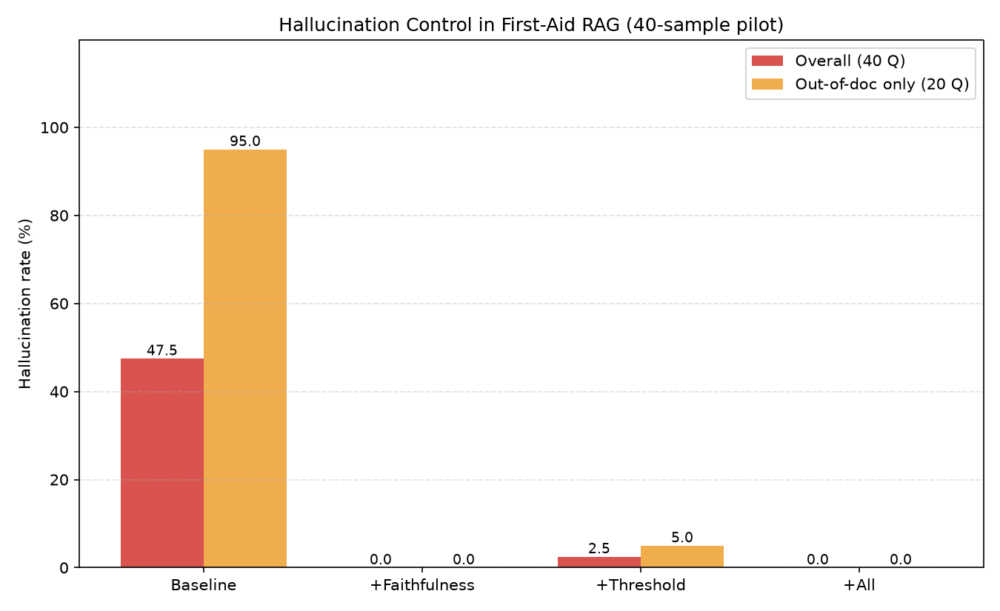

# 응급처치 매뉴얼 RAG 시스템의 환각 제어 (40샘플 예비 실험)

생명과 직결되는 **응급처치 도메인**을 예시로, RAG(Retrieval-Augmented Generation)에서
발생하는 환각(hallucination)이 왜 위험한지 보이고, **3가지 환각 제어 기법**을 켜고 끄며
환각 비율이 어떻게 변하는지 정량적으로 측정한 소규모 실험입니다.

> ⚠️ **정직한 규모 명시**: 본 실험은 **문서 3개 · 질문 40개**로 구성된 **예비 실험(pilot)**입니다.
> 통계적 일반화가 아니라, 환각 제어 기법의 방향성과 트레이드오프를 확인하기 위한 것입니다.
> 문서 내용은 특정 기관 원문을 복제하지 않고 일반 상식 기반으로 직접 작성한 교육용 요약본이며,
> 실제 응급 상황에서는 반드시 119와 전문 의료진의 지시를 따라야 합니다.

---

## 1. 문제: 응급처치 도메인에서 RAG 환각의 위험성

RAG는 검색된 문서를 근거로 답을 생성하지만, **검색 결과가 질문과 무관해도** LLM은 자신의
사전 지식(parametric knowledge)으로 그럴듯한 답을 지어내는 경향이 있습니다.

- 일반 도메인에서는 사소한 오류지만, **응급처치는 잘못된 정보가 곧 생명 위협**입니다.
  (예: 화상에 얼음 사용, 뱀에 물린 부위 절개 등 잘못된 "상식"을 확신에 차 안내)
- 특히 **문서에 아예 없는 주제**(골절, 뇌졸중, 감전 등)를 물었을 때, 시스템이
  "모른다"고 하지 않고 답을 만들어내면 사용자는 이를 검증된 매뉴얼로 오인할 수 있습니다.

본 실험의 **Baseline(제어 없음) RAG는 문서에 없는 질문 20개 전부(100%)에서 환각**을 일으켰습니다.

---

## 2. 3가지 환각 제어 기법

| 기법 | 동작 시점 | 방식 | 실패 시 응답 |
|------|-----------|------|--------------|
| **confidence_threshold** | 생성 **전** | 검색 top 코사인 유사도 < `0.5` 이면 생성을 아예 건너뜀 | "관련 정보 없음" |
| **faithfulness_check** | 생성 **후** | 생성된 답변이 검색 문서에 근거하는지 LLM judge (YES/NO) | "문서에 근거 없어 답변 불가" |
| **self_check** | 생성 **후** | 답변을 문서와 대조해 스스로 재검증 (SUPPORTED/UNSUPPORTED) | "확실하지 않음" |

- **confidence_threshold**는 LLM 호출 없이 임베딩 유사도만으로 걸러 **가장 저렴**하지만,
  임계값이 곧 정답률과 직결되는 **무딘(blunt) 필터**입니다.
- **faithfulness_check / self_check**는 LLM judge를 한 번 더 호출해 **정밀**하지만 비용이 듭니다.
- "관련 정보 없음 / 확실하지 않음" 같은 **거부(abstention)는 환각이 아니라 안전한 정답**으로 집계합니다.
  (지어낸 내용이 없으므로)

검색은 `text-embedding-3-small` + **numpy 코사인 유사도**(ChromaDB 미사용), 생성·판정은
`gpt-4o-mini`를 사용했습니다.

---

## 3. Before / After 결과

**설정**
- **설정1 Baseline** — 기본 RAG (제어 없음)
- **설정2 +Faithfulness** — `faithfulness_check`만 적용
- **설정3 +Threshold** — `confidence_threshold`만 적용
- **설정4 +All** — 세 기법 모두 적용

**질문 40개** = 문서에 답이 있는 질문 20개 + 문서에 없는(환각 유발) 질문 20개

| 설정 | 환각률(전체 40) | 환각률(문서에 없는 20) | 문서 내 질문 정답률(20) | 문서 내 질문 과잉거부율 |
|------|:---:|:---:|:---:|:---:|
| Baseline | **50.0%** | **100.0%** | 100.0% | 0.0% |
| +Faithfulness | **0.0%** | 0.0% | 90.0% | 10.0% |
| +Threshold | **2.5%** | 5.0% | 55.0% | 45.0% |
| +All | **0.0%** | 0.0% | 55.0% | 45.0% |



*(원자료: `results.csv` 요약, `details.csv` 문항별 판정)*

### 읽는 법
- **환각률(빨강)**: 낮을수록 좋음 → 세 기법 모두 Baseline 50% → 0~2.5%로 대폭 감소.
- **문서 내 질문 정답률 / 과잉거부율**: 안전을 얻는 대신 치르는 **비용**.
  환각을 막으려다 **정상 질문까지 거부**해버리면 실사용성이 떨어집니다.

---

## 4. 결론 및 시사점

1. **제어 없는 RAG는 이 도메인에서 위험하다.** 문서에 없는 질문 20개 전부에서 환각이 발생했고
   (100%), 답변은 하나같이 확신에 차 있었습니다. 생명 직결 도메인에서 이는 치명적입니다.

2. **세 기법 모두 환각을 극적으로 줄였지만, 트레이드오프가 서로 다르다.**
   - **faithfulness_check가 이번 실험의 최적 균형**이었습니다: 환각 0%를 달성하면서도
     문서 내 정답률 90%를 유지(과잉거부 10%).
   - **confidence_threshold(0.5)는 가장 저렴하지만 가장 무딘 필터**였습니다. 환각을 2.5%까지
     줄였으나, 임베딩 유사도가 낮게 나온 **정상 질문 45%를 함께 거부**했습니다
     (예: "가슴 압박과 인공호흡 비율"은 유사도 0.499로 아슬아슬하게 차단됨).
   - **+All은 환각 0%로 가장 안전**하지만, threshold의 과잉거부(45%)를 그대로 물려받습니다.

3. **단일 임계값 필터의 한계 → 방어의 계층화(defense in depth)가 필요하다.**
   환각난 out-of-doc 질문 "경련(발작) 환자 돌봄"은 유사도 **0.509로 임계값 0.5를 간신히 넘겨**
   threshold를 통과했지만(+Threshold에서 유일한 환각), **+All에서는 후단의 faithfulness /
   self_check가 이를 잡아내 환각 0%**가 되었습니다. 검색 게이트 하나에만 의존하면 위험합니다.

4. **핵심 시사점**: 고위험 도메인의 RAG는 "얼마나 잘 답하는가"보다 **"모를 때 모른다고 하는가"**가
   더 중요합니다. 환각률과 과잉거부율을 함께 봐야 하며(정밀도-재현율 트레이드오프), 저렴한
   검색 게이트 + 정밀한 생성 후 검증을 **계층적으로** 쌓는 것이 실용적입니다.

---

## 5. 실행 방법


```bash
pip install openai numpy matplotlib python-dotenv
echo "OPENAI_API_KEY=sk-..." > .env

python run.py            # 전체 40문항 × 4설정 실험 → results.csv, details.csv, results.png
SMOKE=1 python run.py    # 4문항으로 파이프라인만 빠르게 점검
```

### 파일 구성
| 파일 | 역할 |
|------|------|
| `data.py` | 응급처치 문서 3개(CPR·하임리히·화상), 단계 단위 청킹 |
| `questions.py` | 질문 40개 (문서에 답 있음 20 / 없음 20) |
| `rag.py` | 임베딩 검색(numpy 코사인) + 답변 생성 + 3가지 환각 제어 토글 |
| `judge.py` | `gpt-4o-mini`로 답변을 GROUNDED / HALLUCINATED 판정 |
| `run.py` | 4설정 실험 실행 → CSV + 그래프 저장 |

---

## 6. 참고 프로젝트

- [Emmimal/hallucination-detector](https://github.com/Emmimal/hallucination-detector) — 구조 참고(축소)
- [Kanisha-Shah/Hallucination-Mitigation-Using-RAG](https://github.com/Kanisha-Shah/Hallucination-Mitigation-Using-RAG)
- [explodinggradients/ragas](https://github.com/explodinggradients/ragas) — faithfulness 평가 개념 참고
- [confident-ai/deepeval](https://github.com/confident-ai/deepeval) — LLM judge 기반 평가 개념 참고
