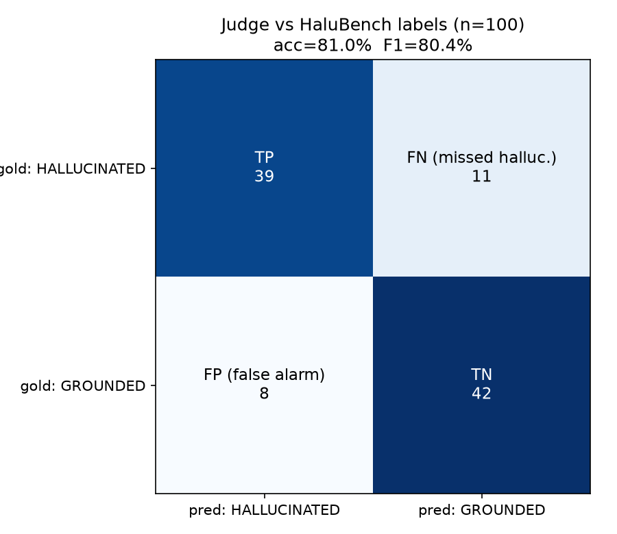
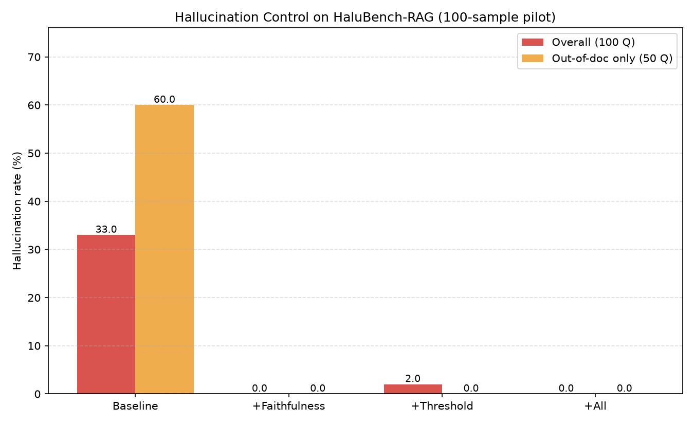

# RAG Hallucination Control with a Validated LLM Judge (HaluBench, 100-sample pilot)

An experiment that quantitatively measures three hallucination-control techniques for
Retrieval-Augmented Generation (RAG) by toggling them on and off. The core idea is a
**two-stage design**:

1. **Step 1 — Judge validation**: first prove that the LLM judge used to score the
   experiment is trustworthy, by measuring how well its verdicts agree with HaluBench's
   ground-truth labels.
2. **Step 2 — Hallucination-control experiment**: use the *validated* judge to compare
   hallucination rates across four configurations.

The point is to **prove the judge is a reliable tool first**, then use that tool to run the
actual experiment. If the judge itself is not credible, the downstream results are not either.

**Scope disclaimer**: this is a **pilot** with **100 samples per stage**. It is not a
statistical generalization; it is a small-scale study to observe the direction and
trade-offs of each technique.

**Dataset**: [PatronusAI/HaluBench](https://huggingface.co/datasets/PatronusAI/HaluBench)
(QA pairs with a grounding passage and a PASS/FAIL label, drawn from sources such as
halueval, FinanceBench, DROP, covidQA, pubmedQA, and RAGTruth). Retrieval uses
`text-embedding-3-small` with numpy cosine similarity; generation and judging use
`gpt-4o-mini`.

---

## Step 1 — LLM Judge Reliability Validation

We drew a **balanced sample of 100** items from HaluBench (**50 PASS / 50 FAIL**) and
compared our judge's verdict on each (passage, question, answer) triple against the
ground-truth label.

- Label mapping: `PASS -> GROUNDED`, `FAIL -> HALLUCINATED`
- Positive class = `HALLUCINATED` (the detection target)

| Metric | Value |
|--------|:---:|
| **Accuracy** | **81.0%** (81/100) |
| Precision | 83.0% |
| Recall | 78.0% |
| F1 | 80.4% |

**Confusion matrix** — TP=39, FN=11, FP=8, TN=42



**Accuracy by source** (halueval dominates the sample by construction):

| source_ds | Accuracy | n |
|-----------|:---:|:---:|
| halueval | 88.9% | 63 |
| pubmedQA | 100.0% | 5 |
| RAGTruth | 77.8% | 9 |
| covidQA | 75.0% | 4 |
| FinanceBench | 63.6% | 11 |
| DROP | 37.5% | 8 |

**Interpretation**: at 81% overall accuracy, the judge is a defensible hallucination
detector (well above the 50% random baseline). However, it is **weak on numeric-reasoning
sources (DROP 37.5%, FinanceBench 63.6%)** — the gpt-4o-mini judge tends to miss subtle
errors in tables and numeric calculations. In other words, the tool is reliable for judging
whether a claim is grounded in the passage, but has limits on precise numeric verification.
Step 1 exists to surface this limitation honestly.

*(Raw data: `judge_validation.csv`)*

---

## The Three Hallucination-Control Techniques

| Technique | When it acts | Mechanism | Fallback response |
|-----------|--------------|-----------|-------------------|
| **confidence_threshold** | **before** generation | skip generation if the top retrieval cosine similarity < `0.5` | "no relevant information" |
| **faithfulness_check** | **after** generation | LLM judge decides whether the answer is grounded in the retrieved passages (YES/NO) | "cannot answer, not grounded in the documents" |
| **self_check** | **after** generation | re-verify the answer against the passages (SUPPORTED/UNSUPPORTED) | "not certain" |

- **confidence_threshold** is the **cheapest** (no LLM call, embedding similarity only), but
  it is a **blunt filter**: the threshold directly determines the answer rate.
- **faithfulness_check / self_check** are **precise** but cost an extra LLM call each.
- An **abstention** such as "no relevant information" / "not certain" is counted as a **safe
  response, not a hallucination** (nothing was fabricated).

---

## Step 2 — Hallucination-Control Experiment (Before / After)

**Design (SQuAD 2.0-style abstention evaluation)**
- Index **50 HaluBench passages as the retrieval corpus** — their 50 questions are
  **answerable (in-doc)**.
- **Hold out another 50 passages** from the corpus — their 50 questions are
  **unanswerable (not in any document)**.
- Run all **100 questions** under four configurations and judge hallucination with the
  Step 1-validated judge.

**Configurations**: (1) Baseline (no control), (2) +Faithfulness, (3) +Threshold,
(4) +All (all three techniques).

| Configuration | Hallucination rate (all 100) | Hallucination rate (unanswerable 50) | Answer rate (answerable 50) | False-refusal rate (answerable) |
|---------------|:---:|:---:|:---:|:---:|
| Baseline | **33.0%** | **60.0%** | 94.0% | 0.0% |
| +Faithfulness | **0.0%** | 0.0% | 84.0% | 16.0% |
| +Threshold | **2.0%** | 0.0% | 78.0% | 18.0% |
| +All | **0.0%** | 0.0% | 74.0% | 26.0% |



*(Raw data: `results_halubench.csv` summary, `details_halubench.csv` per-item verdicts)*

### How to read it
- **Hallucination rate (red)**: lower is better. All three techniques cut it from a 33%
  baseline down to 0-2%.
- **Answer rate / false-refusal rate**: the **cost** paid for safety. If the guard also
  refuses questions it could have answered, usability drops.

---

## Conclusions

1. **Uncontrolled RAG hallucinated on 60% of the unanswerable questions.** Even when the
   retrieved passages are irrelevant, the LLM fabricates a plausible answer from its
   parametric knowledge.

2. **All three techniques cut hallucination dramatically, but with different trade-offs.**
   - **faithfulness_check was the best balance here**: it reached 0% hallucination while
     keeping the highest answerable answer rate (84%, i.e. 16% false refusals).
   - **confidence_threshold (0.5) is the cheapest but the bluntest filter**: it reduced
     hallucination to 2%, but also refused 18% of answerable questions. Its remaining 2
     hallucinations occurred on **answerable questions that passed the similarity gate** —
     a high embedding similarity does not guarantee the generated answer matches the
     passage.
   - **+All is the safest at 0% hallucination**, but it inherits the threshold's
     over-refusal, giving the lowest answer rate (74%, i.e. 26% false refusals).

3. **Key takeaway**: for high-stakes RAG, "does it say *I don't know* when it doesn't know"
   matters more than "how well does it answer." Hallucination rate and false-refusal rate
   must be read together (a precision-recall trade-off), and the practical approach is to
   layer a cheap retrieval gate with precise post-generation verification (defense in depth).

### Limitations
- Each stage is a 100-sample pilot, so confidence intervals are wide.
- The judge itself is only 81% accurate (and weaker on numeric-reasoning sources), so
  Step 2's hallucination rates carry some judging error. Step 1 exists precisely to make
  that error explicit.

---

## How to Run

```bash
pip install openai numpy matplotlib python-dotenv datasets
echo "OPENAI_API_KEY=sk-..." > .env

python validate_judge.py           # Step 1: validate judge -> judge_validation.csv/.png
python run_halubench.py            # Step 2: 4-config control experiment -> results_halubench.*
SMOKE=1 python run_halubench.py    # quick pipeline check on 8 questions

VAL_N=200 python validate_judge.py # adjust the Step 1 sample size
```

### Files
| File | Role |
|------|------|
| `halubench.py` | HaluBench loader — balanced validation sample for Step 1 / corpus + question set for Step 2 |
| `rag.py` | embedding retrieval (numpy cosine) + answer generation + three toggleable hallucination controls |
| `judge.py` | judge answers as GROUNDED / HALLUCINATED with `gpt-4o-mini` |
| `validate_judge.py` | **Step 1** — validate the judge against HaluBench labels |
| `run_halubench.py` | **Step 2** — run the 4-config control experiment -> CSV + chart |

### Outputs
| File | Contents |
|------|----------|
| `judge_validation.csv` / `.png` | Step 1 per-item verdicts / confusion matrix |
| `results_halubench.csv` | Step 2 per-configuration summary metrics |
| `details_halubench.csv` | Step 2 per-item verdicts (400 rows = 100 questions x 4 configs) |
| `results_halubench.png` | Step 2 before/after bar chart |

---

## References

- [PatronusAI/HaluBench](https://huggingface.co/datasets/PatronusAI/HaluBench) — hallucination evaluation benchmark
- [explodinggradients/ragas](https://github.com/explodinggradients/ragas) — faithfulness evaluation concept
- [confident-ai/deepeval](https://github.com/confident-ai/deepeval) — LLM-judge-based evaluation concept
